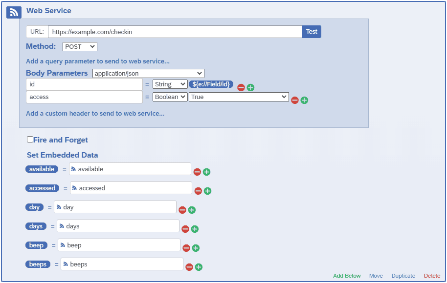

# survey scheduler
A Node.js app to schedule texts for experience sampling studies.


## demo
The [demo study](https://miserman.github.io/survey_scheduler/?study=demo) is a disintegrated version of the interface, which can be used to test the interface.

Participants can be added to the demo study individually through the add or edit menu, or automatically generated by specifying an **n** parameter in the URL; e.g., [miserman.github.io/survey_scheduler/?study=demo&**n=50**](https://miserman.github.io/survey_scheduler/?study=demo&n=50).

Generated participants are based on the default settings in the add or edit > participant menu, which are update when changed -- change the day or time ranges, or protocol settings, and these will be applied to newly generated participants.

Clear local storage (menu > clear storage), or change the specified **n** and refresh to generate new participants.

## status codes
Beeps have associated status codes to keep track of scheduling:

0. _missed_ : Set when a pending beep is outside of its open window.
1. _pending_ : Set when a beep is scheduled; only pending beeps are ever sent.
2. _sent_ : Set when a beep has been sent.
3. _reminded_ : Set when a reminder for a sent beep has been sent.
4. _send_received_ : Set after a beep has been sent, and a checkin with access has been received within the beep's window.
5. _remind_received_ : Set after a reminder has been sent, and a checkin with access has been received within the beep's window.
6. _pause_ : Set from the client, to prevent a passing beep from being sent.
7. _skipped_ : Set when a paused beep has passed.

Outside of status codes, a beep might be a colored a darker blue  when it is the next pending beep to be sent, or black when a beep in the timeline is hovered over.

If delivery status logging is set up, beeps that were successfully sent to SNS (of status _sent_ or _reminded_) but not successfully delivered to the phone (as notified by Lambda) are marked by an asterisk (**\***), and provider responses are displayed when the beep is hovered over.

# running the app
The app has these requirements:
1. Node.js (tested on version 12.16.1).
1. A single, stable environment for scheduling. The app schedules beeps locally, so it has to be running when a beep is meant to be sent. Each time the app is started, it will initially schedule beeps upcoming within a week. If multiple instances of the app are running, beeps may be sent multiple times.
1. Ability to receive HTTP requests for checkins from the survey.

The easiest way to run the app may be from Amazon's [Elastic Beanstalk](https://aws.amazon.com/elasticbeanstalk/), but the app does require a secured connection for [Cognito](https://aws.amazon.com/cognito/)'s callback, which is easiest to set up with a load balancer on Elastic Beanstalk.

Another simple hosting option is Google's [App Engine](https://cloud.google.com/appengine/), but it will sometimes maintain multiple instances by default, so that may be something to manage.

## services
The app uses these [Amazon Web Services](https://aws.amazon.com/) (AWS):

[**Cognito**](https://aws.amazon.com/cognito/): To manage user accounts.
1. From the [Cognito console](https://console.aws.amazon.com/cognito/users), make Create a user pool
    1. In Policies, select Only allow administrators to create users
    1. In App Clients, Add an app client, and check only Enable SRP
    1. Create Pool
1. Create an initial, administrative user with General settings > Users and groups > Create user
1. Set up the App client in App integration > App client settings:
    1. Under Enabled Identity Providers, check Cognito User Pool
    1. In Sign in sign out URLs, enter your URL, with /auth appended to the Callback URL (e.g., http://localhost:3000/auth for testing)
    1. In OAuth 2.0, check Authorization code grant and aws.cognito.signin.user.admin

[**DynamoDB**](https://aws.amazon.com/dynamodb/): To store study information and participant details.

[**SNS**](https://aws.amazon.com/sns/): To send the SMS messages.

#### AWS access
The app needs AWS access to run these services, which can be set up through [IAM](https://console.aws.amazon.com/iam/home#/users):
1. Add user
1. Name whatever, and check Programmatic access
1. Select Attach existing policies directly, and add these policies:
    * AmazonCognitoPowerUser
    * AmazonDynamoDBFullAccess
    * AmazonSNSFullAccess
1. Add the Access key ID and Secret access key to a "credentials" file in, e.g., c:/users/name/.aws:
```
[default]
aws_access_key_id = Access key ID
aws_secret_access_key = Secret access key
```
Alternatively, if the app is running on a service with an IAM role, these policies can be attached to the role rather than a user.

### Delivery Status Logging
By default, the app receives a message's ID when successfully sending it to SNS, but does not know if the message was successfully sent to the phone (the message's delivery status). To get delivery information, you can set up delivery status logging in SNS, and a Lambda function to send logged information to the app:

1. Enable delivery status logging in [SNS](https://console.aws.amazon.com/sns):
    * Mobile > Text messaging (SMS) > edit Text messaging preferences > Delivery status logging
1. Create a [Lambda](https://console.aws.amazon.com/lambda) function:
    * Function > Create Function
    * Author from scratch
    * Name whatever
    * Node.js Runtime
    * Create Function
1. In the Designer section, Add trigger:
    * CloudWatch Logs trigger
    * In the Log group dropdown, you should see a DirectPublishToPhoneNumber/Failure group
    * You can also add the DirectPublishToPhoneNumber group to receive all delivery responses
    * Name whatever, other options default
1. Put this as the function's code, replacing the hostname with your URL, then Save:
```JavaScript
const http = require('https'), zlib = require('zlib');
exports.handler = async function(event, context){
  return new Promise(function(resolve, reject){
    if(event.awslogs && event.awslogs.data){
      var data = Buffer.from(event.awslogs.data, 'base64'), p = /^{/, i, s = {}, body, req;
      zlib.gunzip(data, function(e, d){
        if(e){
          reject(Error(e));
        }else{
          for(d = JSON.parse(d.toString('ascii')).logEvents, i = d.length; i--;) if(p.test(d[i].message)){
            s = JSON.parse(d[i].message);
            if(s.notification && s.notification.messageId){
              body = JSON.stringify({
                messageId: s.notification.messageId,
                timestamp: d[i].timestamp || s.notification.timestamp,
                providerResponse: s.delivery && s.delivery.providerResponse ? s.delivery.providerResponse : '',
                status: s.status
              });
              req = http.request({
                method: 'POST',
                hostname: 'example.com',
                path: '/status',
                headers: {
                  'Content-Type': 'application/json',
                  'Content-Length': Buffer.byteLength(body)
                }
              }, function(res){
                console.log('sent status for message', s.notification.messageId);
              });
              req.on('error', function(e){
                reject(Error(e));
              });
              req.write(body);
              req.end();
            }
          }
        }
      });
    }else reject(Error('event is not in the expected format'));
  });
};
```

### Qualtrics
The app is set up with [Qualtrics](https://www.qualtrics.com) in mind, though other platforms could be used. The app sends survey links with an added participant ID parameter, which the survey would need to extract in order to associate participants with responses through the link. In Qualtrics, you can get this by setting an Embedded Data variable matching the protocol's specified ID parameter:
1. In a survey, select Survey Flow
1. Add an Embedded Data element from the Add a New Element Here menu
1. Create New Field matching your ID parameter (e.g., "id"), and leave its value blank.

Qualtrics can also checkin with the app when the survey is accessed:
1. In a survey, select Survey Flow
1. Add a Web Service element from the Add a New Element Here menu
1. Enter your URL appended with /checkin
1. Set Method to POST
1. Add a body parameter, and set its Body Parameters to application/json, Parameter to your ID parameter, and set a String to the extracted ID via Piped Text (e.g., ${e://Field/id})
1. If you want the checkin to also update the corresponding beep's status and access count, add a body parameter called "access" with a Boolean value of True. The "access" parameter can be used to separate an availability check from a status and accessed count update. For example, you might place a Web Services element without an "access" parameter at the start of the survey, and use it to gate access to the survey (if the survey is visited outside of a beep window, or more than allowed accesses), then add another Web Services element with an "access" parameter after the survey has been started. This would help avoid response time or loading issues in the case of limited allowed accesses (e.g., if the checkin goes through but the survey fails to fully load or receive a response in time, the survey can be refreshed without counting as another access).
1. Finally, Add Embedded Data..., and set a value for available, accessed, day, days, beep, and beeps


If the app recognizes the ID, it responds with an object like this:
```javascript
{
  available: true,
  accessed: 3,
  day: 0,
  days: 12,
  beep: 1,
  beeps: 6
}
```
Here, available is based on the most recently passed beep and the associated protocol's allowed accesses and close after settings. That is, available will be true if a beep had been accessed fewer than allowed accesses, and was sent no longer ago than the associated protocol's close after setting (or the associated protocol has no close after setting).

This information can be used from within Qualtrics to regulate access or condition questions on schedule status. For example, adding this as a question's JavaScript would prevent proceeding if available is false, and otherwise display schedule information:
```javascript
Qualtrics.SurveyEngine.addOnload(function(){
  var message = $("message"), id = "${e://Field/id}", response = {
    available: "${e://Field/available}",
    accessed: "${e://Field/accessed}",
    beeps: "${e://Field/beeps}",
    beep: "${e://Field/beep}",
    days: "${e://Field/days}",
    day: "${e://Field/day}",
  }
  this.disableNextButton()
  if(id !== "" && response.available === "true"){
    message.innerText = "Participant " + id + "; survey " + response.beep + " of "
      + response.beeps + " for day " + response.day + " of " + response.days
      + ", accessed " + response.accessed + " times."
    this.enableNextButton()
  }
});
```
Here, message refers to an HTML element in the question's body, with "message" as its id, e.g.:
```html
<p id="message">Wait for a text to complete this survey.<p>
```

## environment variables
[server.js](https://github.com/miserman/survey_scheduler/blob/master/server.js) uses these environment variables:
* **PORT**: The port the server listens to; often 3000 or 8081
* **REGION**: AWS region, e.g., "us-east-1"
* **USERPOOL**: Cognito Pool ID, from [User Pool](https://console.aws.amazon.com/cognito/users) > General settings
* **CLIENT**: Cognito App client ID, from [User Pool](https://console.aws.amazon.com/cognito/users) > App integration > App client settings
* **DOMAIN**: Cognito domain, from [User Pool](https://console.aws.amazon.com/cognito/users) > App integration > Domain name
* **REDIRECT**: URL set as the callback in [User Pool](https://console.aws.amazon.com/cognito/users) > App integration > App client settings; [server.js](https://github.com/miserman/survey_scheduler/blob/master/server.js) assumes this is /auth
* **ADMIN**: Username of an initial user set up through [User Pool](https://console.aws.amazon.com/cognito/users) > General settings > Users and groups > Create user; this user has full access to all studies; additional, study specific users should be created through the interface
* **NOTIFICATIONS**: Optional topic for notifications about status updates and/or missed beeps; ARN from [SNS](https://console.aws.amazon.com/sns) > Topics > created topic
* **DOUBLECHECK_FREQ**: Optional frequency in minutes to scan the local schedule for passed beeps that are still marked as pending (uncaught, missed beeps). If these beeps are caught in time, they will be sent. If any beeps are caught, they will be reported to the NOTIFICATIONS topic.
* **REPORT_HOUR**: Optional hour (in the server's time) at which to send a daily status report to the NOTIFICATIONS topic, including number of sent and responded to, or skipped beeps. A report will only be sent if there were scheduled beeps since the last scheduled report, or since the app was started.
